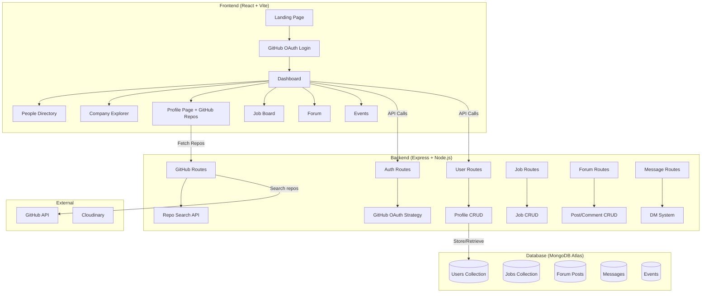

# Alumni Connect — College Networking Platform

A web platform where alumni, seniors, and juniors of your college can register, discover each other by company/batch, showcase GitHub projects, and build meaningful professional connections.

---

## Your Core Ideas (Validated ✅)

| # | Idea | Feasibility |
|---|------|-------------|
| 1 | Registration & profiles for alumni/seniors/juniors | ✅ Straightforward |
| 2 | Browse people grouped by company | ✅ Great discovery feature |
| 3 | LinkedIn integration for current company info | ⚠️ Needs alternative approach (see below) |
| 4 | Click a person → see their GitHub repos tagged for this app | ✅ GitHub Search API supports `in:readme` filtering |
| 5 | Only repos with your app's name in README are shown | ✅ `GET /search/repositories?q=AlumniConnect+in:readme+user:{username}` |

---

## Open Questions

> [!IMPORTANT]
> ### Please answer these before I begin building:
> 1. **What is your college name?** (Used for branding, domain, and the README keyword for GitHub repo filtering)
> 2. **App Name** — Do you want to call it "Alumni Connect" or something else? This name becomes the keyword users put in their README to tag projects.
> 3. **Do you want GitHub OAuth login** (users sign in with GitHub — this also gives us automatic access to their repos) **or traditional email/password registration?** I strongly recommend GitHub OAuth since your app is developer-focused.
> 4. **LinkedIn data** — Since LinkedIn's API is heavily restricted, I suggest users **manually enter their current company & position** during registration (with an optional LinkedIn profile URL link). Is that acceptable, or do you want me to explore third-party scraping APIs?
> 5. **Deployment target** — Render (you've used it before), Vercel, or something else?
> 6. **Do you want an admin panel** to verify/manage users, or should it be fully open?

---

## Suggested Improvements & New Features

Here are features I recommend adding beyond your initial concept:

### 🔥 High Priority (Must-Have)

| Feature | Why |
|---------|-----|
| **GitHub OAuth Login** | One-click sign-in, auto-fetches GitHub username & avatar — no passwords to manage |
| **Batch/Year Filter** | Browse people by graduation year (2020, 2021, etc.) — essential for a college platform |
| **Skills & Tech Stack Tags** | Users tag themselves with skills (React, Python, ML, etc.) — enables skill-based discovery |
| **Search & Filter System** | Search by name, company, batch, skills, role — the core discovery experience |
| **Profile Page** | Rich profile: avatar, bio, batch year, role, company, LinkedIn URL, GitHub repos, skills |
| **Responsive Mobile Design** | College students primarily use phones — must work perfectly on mobile |

### 💡 Medium Priority (Strongly Recommended)

| Feature | Why |
|---------|-----|
| **Mentorship Matching** | Seniors/alumni can opt-in as mentors; juniors can request mentorship — high engagement |
| **Job/Internship Board** | Alumni post opportunities at their companies — massive value for students |
| **Discussion Forum** | Topic-based threads (Placements, DSA, Projects, College Life) — builds community |
| **Direct Messaging** | Private messaging between users — enables real networking |
| **Events Section** | Alumni meetups, webinars, hackathons — keeps community active |
| **Activity Feed** | Recent joins, project uploads, job posts — makes the platform feel alive |

### 🌟 Nice-to-Have (Future Scope)

| Feature | Why |
|---------|-----|
| **Leaderboard** | Top contributors by projects, mentorship hours, forum activity |
| **Company Pages** | Dedicated page for each company showing all members from your college |
| **Achievement Badges** | "Open Source Contributor", "Mentor", "100 Days of Code" — gamification |
| **Dark/Light Theme** | Modern aesthetic preference |
| **Email Notifications** | New messages, mentorship requests, job posts |
| **Analytics Dashboard** | Admin sees engagement metrics, popular companies, batch statistics |

---

## Proposed Architecture

### Tech Stack

| Layer | Technology | Rationale |
|-------|-----------|-----------|
| **Frontend** | React (Vite) | Fast, component-based, you're familiar with it |
| **Styling** | Vanilla CSS with CSS variables | Full control, premium dark theme |
| **Backend** | Node.js + Express | Consistent JS stack, excellent ecosystem |
| **Database** | MongoDB Atlas | Flexible schema for profiles, free tier available |
| **Auth** | GitHub OAuth 2.0 (via Passport.js) | Zero-password UX, auto GitHub data |
| **External APIs** | GitHub REST API | Repo search with `in:readme` filter |
| **File Storage** | Cloudinary | Profile pictures, event images |
| **Deployment** | Render | You've deployed MERN apps here before |

### System Architecture



---

## Proposed Changes

### Phase 1 — Foundation & Auth

#### [NEW] Backend Setup

| File | Purpose |
|------|---------|
| `server/server.js` | Express app entry point, middleware setup |
| `server/config/db.js` | MongoDB Atlas connection |
| `server/config/passport.js` | GitHub OAuth strategy configuration |
| `server/.env` | Environment variables (secrets, DB URI, GitHub OAuth keys) |
| `server/package.json` | Backend dependencies |

#### [NEW] Auth System

| File | Purpose |
|------|---------|
| `server/routes/auth.js` | GitHub OAuth routes (`/auth/github`, `/auth/github/callback`, `/auth/logout`) |
| `server/models/User.js` | User schema (name, githubId, avatar, batch, role, company, skills, linkedinUrl) |
| `server/middleware/auth.js` | JWT verification middleware for protected routes |

---

### Phase 2 — Frontend Foundation

#### [NEW] React App (Vite)

| File | Purpose |
|------|---------|
| `client/` | Vite + React project |
| `client/src/index.css` | Design system — dark theme, CSS variables, typography, animations |
| `client/src/App.jsx` | Root component with React Router |
| `client/src/context/AuthContext.jsx` | Authentication state management |
| `client/src/components/Navbar.jsx` | Navigation bar with auth state |
| `client/src/components/Footer.jsx` | Footer component |

#### [NEW] Pages

| File | Purpose |
|------|---------|
| `client/src/pages/Landing.jsx` | Hero section, features showcase, CTA |
| `client/src/pages/Dashboard.jsx` | Activity feed, quick stats |
| `client/src/pages/People.jsx` | Filterable people directory (by batch, company, skills, role) |
| `client/src/pages/CompanyExplorer.jsx` | Companies grid → click to see all members from that company |
| `client/src/pages/Profile.jsx` | User profile + GitHub repos (filtered by README keyword) |
| `client/src/pages/EditProfile.jsx` | Edit profile form (company, skills, bio, LinkedIn URL) |

---

### Phase 3 — GitHub Integration

#### [NEW] GitHub Repo Service

| File | Purpose |
|------|---------|
| `server/routes/github.js` | `/api/github/repos/:username` — proxies GitHub Search API |
| `server/services/githubService.js` | Calls `api.github.com/search/repositories?q={APP_NAME}+in:readme+user:{username}` |
| `client/src/components/RepoCard.jsx` | Displays repo: name, description, stars, language, last updated |
| `client/src/components/RepoGrid.jsx` | Grid of RepoCards on profile page |

---

### Phase 4 — Community Features

#### [NEW] Job Board

| File | Purpose |
|------|---------|
| `server/models/Job.js` | Job schema (title, company, type, description, postedBy, applyLink) |
| `server/routes/jobs.js` | CRUD routes for jobs |
| `client/src/pages/Jobs.jsx` | Job listings with filters |
| `client/src/components/JobCard.jsx` | Individual job card |

#### [NEW] Discussion Forum

| File | Purpose |
|------|---------|
| `server/models/Post.js` | Forum post schema (title, content, author, category, comments, likes) |
| `server/routes/posts.js` | CRUD + comment routes |
| `client/src/pages/Forum.jsx` | Forum with category tabs |
| `client/src/components/PostCard.jsx` | Forum post card |

#### [NEW] Direct Messaging

| File | Purpose |
|------|---------|
| `server/models/Message.js` | Message schema (sender, receiver, content, timestamp, read) |
| `server/routes/messages.js` | Send/receive message routes |
| `client/src/pages/Messages.jsx` | Chat interface |
| `client/src/components/ChatWindow.jsx` | Real-time chat UI |

---

### Phase 5 — Events & Admin

#### [NEW] Events

| File | Purpose |
|------|---------|
| `server/models/Event.js` | Event schema (title, date, description, organizer, attendees) |
| `server/routes/events.js` | CRUD + RSVP routes |
| `client/src/pages/Events.jsx` | Events listing & calendar view |

#### [NEW] Admin Dashboard (if approved)

| File | Purpose |
|------|---------|
| `server/middleware/admin.js` | Admin role check middleware |
| `server/routes/admin.js` | User management, analytics endpoints |
| `client/src/pages/AdminDashboard.jsx` | User verification, stats, content moderation |

---

## Data Models

### User Schema (MongoDB)

```javascript
{
  githubId: String,          // From GitHub OAuth
  username: String,          // GitHub username
  name: String,              // Display name
  email: String,             // From GitHub
  avatar: String,            // GitHub avatar URL
  bio: String,               // Short bio
  role: {                    // Role in college
    type: String, 
    enum: ['junior', 'senior', 'alumni']
  },
  batchYear: Number,         // Graduation year (e.g., 2025)
  branch: String,            // CS, IT, ECE, etc.
  currentCompany: String,    // Manually entered
  currentPosition: String,   // Job title
  linkedinUrl: String,       // LinkedIn profile link
  skills: [String],          // ['React', 'Node.js', 'Python']
  isAdmin: Boolean,
  isMentor: Boolean,         // Available for mentorship
  mentorTopics: [String],    // What they can mentor on
  createdAt: Date,
  lastActive: Date
}
```

---

## LinkedIn Data Strategy

> [!WARNING]
> LinkedIn's API is **heavily restricted** — you cannot fetch other users' company data without enterprise partnerships.

### Recommended Approach:
1. **Manual Entry** — Users enter their current company & position during profile setup
2. **LinkedIn URL** — Store their LinkedIn profile URL as a clickable link
3. **Company Autocomplete** — Provide a searchable dropdown of known companies (populated from existing users' entries) to keep data consistent

This is how most college networking platforms handle it. It's reliable, legal, and doesn't depend on fragile third-party scrapers.

---

## GitHub Repo Filtering Logic

```
User visits a profile → App calls backend → Backend calls GitHub API:

GET https://api.github.com/search/repositories?q={APP_NAME}+in:readme+user:{github_username}

→ Returns only repos where README contains your app's name
→ Frontend renders these as project showcase cards
```

Users simply add a line like `Built for AlumniConnect` or `#AlumniConnect` in their project's README, and it automatically appears on their profile.

---

## UI/UX Design Direction

- **Theme**: Premium dark mode with accent gradients (deep navy → electric purple)
- **Typography**: Inter font family (clean, modern, professional)
- **Cards**: Glassmorphism effect with subtle backdrop blur
- **Animations**: Smooth page transitions, hover micro-interactions, skeleton loading states
- **Layout**: Responsive grid — works seamlessly on mobile and desktop
- **Color Palette**: 
  - Background: `#0a0a1a` → `#12122a`
  - Cards: `rgba(255,255,255,0.05)` with blur
  - Accent: `#7c3aed` (purple) → `#06b6d4` (cyan) gradient
  - Text: `#f1f5f9` (primary), `#94a3b8` (secondary)

---

## Verification Plan

### Automated Tests
- Backend API testing with Postman/Thunder Client
- GitHub OAuth flow end-to-end test in browser
- GitHub repo search API validation with real GitHub accounts

### Manual Verification
- Complete user registration flow via GitHub OAuth
- Profile creation and editing
- People directory filtering (by batch, company, skills)
- Company explorer page grouping
- GitHub repo display on profile pages
- Job posting and browsing
- Forum posting and commenting
- Responsive design on mobile viewport
- Deploy to Render and test production build

---

## Implementation Order

```
Phase 1 (Days 1-2): Backend foundation + GitHub OAuth + User model
Phase 2 (Days 3-5): Frontend foundation + Landing + Dashboard + People Directory
Phase 3 (Day 6):    GitHub repo integration + Profile pages
Phase 4 (Days 7-9): Job Board + Forum + Messaging
Phase 5 (Day 10):   Events + Admin + Polish + Deploy
```

> [!NOTE]
> We can start with Phases 1-3 (the core experience) and add community features incrementally. This way you'll have a working MVP quickly.
